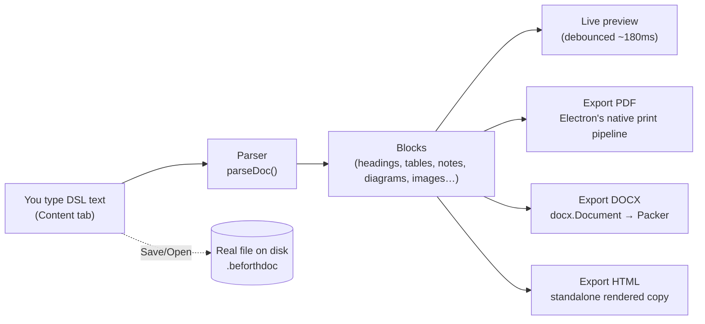

# Beforth Doc Studio

A desktop app for writing branded documents and exporting them straight to
**PDF** and **DOCX** — with real diagrams (written as text, like flowcharts)
and your own images dropped in. Native file save/open, no browser tab, no
localStorage — it behaves like a real app because it is one.

> This replaces the earlier single-HTML-file prototype
> (`beforth-doc-studio.html`, still in this folder for reference). That
> version traded features for "just open one file, anywhere" portability;
> this version trades that portability for being an actual installable app
> with real file storage, native exports, and diagram/image support.

---

## Running it

```bash
npm install
npm start
```

That opens the app in its own window. No account, no internet required
except the first time (to fetch the Bebas Neue / Inter fonts).

To build a standalone `.app` you can double-click without `npm start`:

```bash
npm run dist
```

(Output lands in `dist/`. Packaging as a signed/notarized installer is a
separate step this project doesn't do yet — the unsigned build runs fine
launched directly, macOS Gatekeeper may just ask you to confirm once.)

---

## The screen, at a glance

```
┌──────────────────────────────────────────────────────────────────────────────────────┐
│ BEFORTH DOC STUDIO   ● My Document   [New][Open…][Save][Save As…]      3 pages        │
│                                    [Insert Image…][Insert Diagram][Export HTML/DOCX/PDF]│
├───────────────────────────────┬──────────────────────────────────────────────────────┤
│ Document Info │ Content │ Guide│                                                      │
│                                │              ┌─────────────────────────────┐         │
│  Kicker      [___________]    │              │       (dot-grid)            │         │
│  Title       [___________]    │              │  KICKER                    │          │
│  ...                           │              │  BEFORTH                   │          │
│                                │              │  Big Title Here            │          │
│  (or, on the Content tab:)     │              │  short description…        │          │
│  ┌───────────────────────────┐│              └─────────────────────────────┘         │
│  │ # 1 | Introduction        ││                 ← live preview, scrolls like the      │
│  │ DIAGRAM: Flow              ││                   real exported document             │
│  │ graph LR                  ││                                                       │
│  │  A --> B                  ││                                                       │
│  │ END DIAGRAM               ││                                                       │
│  └───────────────────────────┘│                                                       │
└───────────────────────────────┴──────────────────────────────────────────────────────┘
```

- **● dot next to the filename** — unsaved changes. Turns off once you Save.
- **Document Info tab** — cover page + header/footer metadata.
- **Content tab** — the document body, written in the DSL below.
- **Syntax Guide tab** — the same reference, built into the app.
- Page count badge updates live; a toast confirms every save/open/export and
  every time the page count changes.

**Keyboard shortcuts:** `⌘N` New · `⌘O` Open · `⌘S` Save · `⇧⌘S` Save As ·
`⌘I` Insert Image · `⌘D` Insert Diagram · `⌘P` Export PDF · `⌘E` Export DOCX

---

## How content flows through the app



Everything is derived purely from what you type or the files you explicitly
import — the tool never invents placeholder numbers or content to fill space.

---

## Writing content — the syntax

Every block is **case-insensitive** and (with a few one-liners) closed with
an explicit `END ...` tag. Every collector stops itself the moment it sees
the start of a new recognized block, even without the right `END` line — so
one typo never silently swallows the rest of your document.

### Headings — also builds your Table of Contents automatically

```
# 1 | Introduction
## 1.1 | Purpose
```
`#` = major section, and starts its own new page automatically. `##` = sub-heading.

### Page control

```
PAGEBREAK
```
Ends the current page, starts a fresh one for whatever comes next.

```
BLANKPAGE
```
A completely empty page — a spacer or divider before an appendix.

### Diagrams — flowcharts, written as text

```
DIAGRAM: High-level Flow
graph LR
  A[Intake] --> B[Processing]
  B --> C[Review]
  C --> D[Completion]
END DIAGRAM
```
Uses [Mermaid](https://mermaid.js.org/intro/syntax-reference.html) syntax —
flowcharts, sequence diagrams, and more. Renders live in the preview and
embeds as a real image in both the PDF and DOCX export. Click **Insert
Diagram** (or `⌘D`) for a starter template you can edit.

### Images — your own design files, screenshots, exported diagrams

```
IMAGE: /Users/you/Desktop/architecture.png | Optional caption
```
Click **Insert Image…** (or `⌘I`) to pick a file with the native file
picker — it writes the correct path for you. PNG, JPG, GIF, WEBP, and SVG
all work, and get embedded as real images in the DOCX export too.

### Paragraphs & inline formatting

Plain text, blank line = new paragraph. `**bold**` → **bold**. `->` → `→`.

### Small blocks

```
PILL: 4.1 Item & Vendor Master
```
A small badge label above a table.

```
NOTE: Track of Material Means
Being able to see where a used item ended up.
END NOTE
```
Blue callout box.

```
EXAMPLE: Worked Example
If minimum stock is 10 and the buffer is +30, the reminder fires at 40 units.
END EXAMPLE
```
Yellow callout box.

### Tables

```
TABLE REQ
ITM-01 | Every item record shall store Name, Quantity, Rate, Value. | Memo 8
END TABLE
```
Formal `ID | Requirement | Source` spec table.

```
TABLE DATA
Plan | Spare Parts | Labour
AMC | Not included | Free
END TABLE
```
Generic table — first row is headers, any number of columns.

```
TABLE PRICE
Item | Description | Qty | Rate | Amount
Website Development | Full-stack build | 1 | 150000 | 150000
END TABLE
```
Numeric/currency/percentage columns auto-detect and right-align — for
quotations and invoices.

### Lists & grids

```
TOTALS
Subtotal :: 162000
Tax (18% GST) :: 28260
Total :: 185260
END TOTALS
```
Right-aligned; the **last** row is bold with a rule above it.

```
CARDS
Store Department :: Receives material, manages racks/locations.
END CARDS
```
Bordered card grid — roles, actors, glossary-adjacent terms.

```
STEPS
Work order is created from the contract.
END STEPS
```
Numbered list with circular badges.

```
BULLETS
Prices are valid for 30 days from the date of this quotation.
END BULLETS
```
Plain bullet list — terms & conditions.

```
GLOSSARY
RM :: Raw Material
END GLOSSARY
```

```
SIGNATURE
For Beforth :: Authorized Signatory
For Client :: Authorized Signatory
END SIGNATURE
```
Side-by-side signature line blocks.

---

## Exporting

| Action | What it does |
|---|---|
| **Export PDF** (`⌘P`) | Renders a real PDF straight to disk via a native save dialog — no print preview needed. |
| **Export DOCX** (`⌘E`) | Generates a real, editable Word file — tables, colors, header/footer with page numbers, dotted-leader Table of Contents, and every diagram/image embedded as a real picture. |
| **Export HTML** | Saves a standalone rendered copy (fonts + CSS inlined) you can reopen, print, or email. |

## Saving & opening documents

Real files on disk — `.beforthdoc` (plain text under the hood, so it's also
diffable/version-controllable if you want). **Save** / **Save As…** / **Open…**
all use your OS's native file dialogs. The title bar's filename dot (●)
tells you when you have unsaved changes.

---

## Design system (for reference)

| Token | Hex | Used for |
|---|---|---|
| Navy | `#0D1117` | Headings, table headers, primary text |
| Deep Navy | `#1C2333` | Body copy |
| Blue | `#1A5BFF` | Accent — section numbers, links, totals |
| Slate | `#EDF0F8` | Cover page background |
| Stone | `#6B7280` | Muted/secondary text |
| Border | `#D1D8E8` | Table borders, dividers |
| Blue Tint | `#EBF0FF` | Alternating table rows, callout fills |
| Dot | `#C2CEE8` | Cover page dot-grid texture |

Fonts: **Bebas Neue** (headings) + **Inter** (body, weights 300–700).

---

## Project structure

```
package.json            electron / electron-builder / docx / mermaid deps
src/
  main/
    main.js              window, native menu, file dialogs, PDF/DOCX save, IPC
  renderer/
    index.html            app shell
    styles.css             design system + app chrome
    app.js                  UI wiring, file ops, insert image/diagram, exports
    parser.js                the DSL parser (isBlockStarter-guarded)
    render.js                 HTML preview renderer
    docxBuilder.js             docx.Document builder
    mediaResolver.js           Mermaid → SVG/PNG, image file → PNG (for DOCX)
```

---

## FAQ

**Can I use this for something other than a requirements spec?**
Yes — every block works the same regardless of document type. Change the
Kicker field to "Quotation," "Proposal," etc.

**Does anything get sent to a server?**
No. Parsing, rendering, diagram rasterization, and DOCX generation all run
locally. The only network request is the initial Google Fonts fetch.
